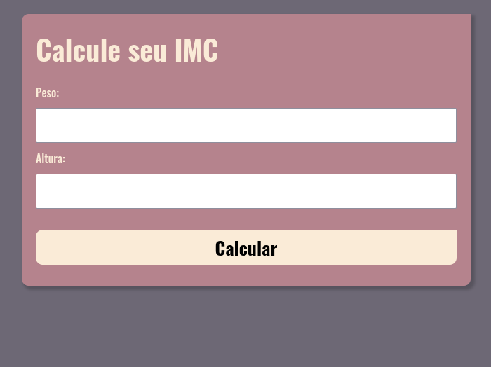

<h1>BMI Calculator Or IMC Calculator🖩</h1> 
 
<h2>
Calculator🖩
<h2>

Technologies used in project:

✔HTML;

✔CSS;

✔Javascript;

<h2>Explanation:</h2>

-Use this for calc your BMI or IMC level;
-Link: https://imccalculator-jhonatanmizu.netlify.app/

Screenshots:

